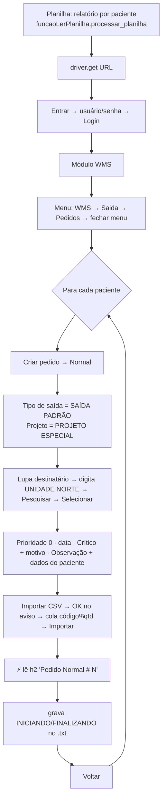
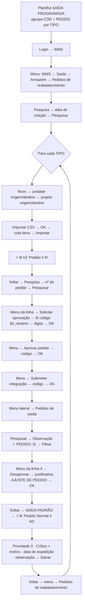
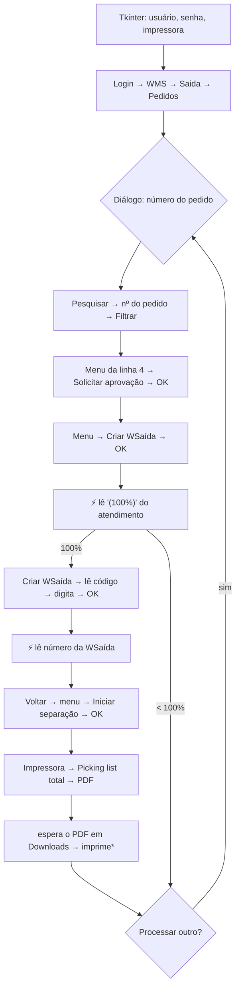

# 02 · Mapa de rotas (engenharia reversa)

Levantado lendo o código das 3 automações da categoria A. Todos os localizadores abaixo são **os originais do código do Kalleb** e foram reproduzidos no simulador exatamente como estão — **nenhum XPath precisou ser trocado** (nem os absolutos, do tipo `/html/body/div[4]/...`). Para isso o simulador monta o mesmo "esqueleto" de `
` que o sistema original (ver "Truques de estrutura" no fim).

Legenda de esperas: todas as ações passam pelas funções de `funcaos.py`, que esperam o elemento ficar **clicável** (`element_to_be_clickable`) ou **presente** (`presence_of_element_located`), com tentativas de `tempo_inicial` → 5 s → 30 s → `refresh` + 40 s. Os robôs de pedidos e de reabastecimento dormem 2 s antes de cada ação; o avançador usa `tempo_inicial=0` (vai o mais rápido possível). Os pontos em que o robô **lê a tela sem esperar** (`driver.find_element`) estão marcados com ⚡ — ali o simulador precisa responder na hora.

---

## 1. Fluxogramas

### 1.1 Robô que cria pedidos (`robo_cria_pedidos`)

### 1.2 Robô de reabastecimento (`robo_reabastecimento`)

### 1.3 Avançador de pedidos (`avancador_de_pedidos`)

\* Na demonstração a impressão é simulada (`IMPRIMIR_DE_VERDADE = False`).

---

## 2. Telas necessárias (unificadas)

| # | Tela no simulador | Arquivo | Usada por |
|---|---|---|---|
| T1 | Entrada + login | `index.html` | os 3 robôs |
| T2 | Seleção de módulos | `modulos.html` | os 3 robôs |
| T3 | Início do WMS + **menu lateral** (o menu existe em todas as telas internas) | `wms.html` | os 3 robôs |
| T4 | Pedidos de saída (lista, filtro, menus de ação) **+ modo "Gerenciar WSaída"** na mesma página | `pedidos.html` | os 3 robôs |
| T5 | Pedido Normal (novo e edição) | `pedido.html` | cria pedidos · reabastecimento |
| T6 | Pedidos de reabastecimento (lista) | `reabastecimento.html` | reabastecimento |
| T7 | Novo pedido de reabastecimento | `reabastecimento_novo.html` | reabastecimento |

---

## 3. Elementos por tela

### T1 · Login (`index.html`)

| Elemento | Localizador original | Tipo | Comportamento esperado |
|---|---|---|---|
| Entrar | `//a[contains(text(),'Entrar')]` | link | Mostra o cartão de login (o primeiro "Entrar" da página é o do topo). |
| Usuário | `//input[@name='data[Usuario][login]']` | input | Aceita qualquer texto. |
| Senha | `//input[@name='data[Usuario][senha]']` | input password | Aceita qualquer texto. |
| Login | `//input[@type='submit' and @value='Login']` | submit | "Validando acesso…" (0,5–0,9 s) e vai para Módulos. |

### T2 · Módulos (`modulos.html`)

| Elemento | Localizador original | Tipo | Comportamento esperado |
|---|---|---|---|
| Módulo WMS | `//div[contains(@class, 'link-modulo') and contains(@link, '/Homes/index/wms')]` | div clicável | Abre o início do WMS. |

### T3 · Menu lateral (todas as telas internas)

| Elemento | Localizador original | Tipo | Comportamento esperado |
|---|---|---|---|
| Abrir menu | `//span[contains(@class, 'menu-anchor-opendata')]` | span | Abre o menu deslizante. |
| WMS | `//a[contains(@class, 'list-group-item') and contains(text(), 'WMS')]` | grupo | Expande (clicar de novo não recolhe; a expansão fica memorizada). |
| Saida | `//a[contains(@class, 'list-group-item') and contains(text(), 'Saida')]` | grupo | Expande. Texto sem acento, como no original. |
| Armazém | `//a[contains(@class, 'list-group-item') and contains(text(), 'Armazém')]` | grupo | Expande (fica dentro de Saida). |
| Pedidos | `//a[contains(@class, 'list-group-item') and contains(text(), 'Pedidos')]` | link | Vai para T4. **Precisa vir antes** de "Pedidos de reabastecimento" no HTML, porque o `contains` pega o primeiro. |
| Pedidos de reabastecimento | `//a[contains(@class, 'list-group-item') and contains(text(), 'Pedidos de reabastecimento')]` | link | Vai para T6. |
| Fechar menu | `//*[@id="closeMenuOpendata"]/span` | span | Fecha o menu. Ao navegar pelo menu, a tela seguinte já abre com o menu aberto (o robô clica no X depois de navegar). |

### T4 · Pedidos de saída (`pedidos.html`)

| Elemento | Localizador original | Tipo | Comportamento esperado |
|---|---|---|---|
| Criar pedido | `//*[@id="dropdownCadastrarPedido"]` | botão | Abre o menu de tipos. |
| Normal | `//*[@id="accordion"]/div/div[1]/ul/li[1]/a` | link | Abre T5 com um número novo. |
| Pesquisar (abrir filtro) | `/html/body/div[4]/div[2]/div[3]/div[3]/div/div/h4/a` | link | Só **abre** o filtro (o "×" recolhe) — assim funciona a cada volta do laço. |
| Nº do pedido | `//*[@id="filtro_nnumero_ped"]` | input | Filtro exato por número. |
| Observação | `/html/body/div[4]/div[2]/div[3]/div[3]/div/form/div[2]/div/div[2]/fieldset[1]/div[9]/div/div/input` | input | Filtro "contém" na observação (usado com `PEDIDO: N`). |
| Filtrar | `/html/body/div[4]/div[2]/div[3]/div[3]/div/form/div[2]/div/div[2]/fieldset[5]/div/div/div/button` | botão | Esconde as linhas na hora, "Filtrando…" 0,35–0,9 s, redesenha. |
| Menu da linha | `/html/body/div[4]/div[2]/div[3]/table/tbody/tr[4]/td[12]/div/span` | span | Abre o menu de ações do 1º resultado (as 3 primeiras linhas do `tbody` são resumo, "atualizando" e "vazio"). |
| Solicitar aprovação | `//*[@id="table_results"]/tbody/tr[4]/td[12]/div/ul/li[6]/a` | link | Status "Em digitação": abre confirmação (div[16]); OK → **Aprovado**. |
| Criar WSaída | `//*[@id="table_results"]/tbody/tr[4]/td[12]/div/ul/li[8]/a` | link | Status "Aprovado": confirmação; OK → abre "Gerenciar WSaída" **na hora**. |
| Iniciar separação | `/html/body/div[4]/div[2]/div[3]/table/tbody/tr[4]/td[12]/div/ul/li[6]/a` | link | Status "WSaída criada": confirmação; OK → **Em separação**. |
| Desaprovar pedido | `/html/body/div[4]/div[2]/div[3]/table/tbody/tr[4]/td[12]/div/ul/li[7]/a` | link | Status "Aprovado": abre justificativa (div[19]); OK → **Em digitação**. |
| Editar | `/html/body/div[4]/div[2]/div[3]/table/tbody/tr[4]/td[9]/a` | link | Abre T5 em modo edição (só "Em digitação"). |
| Impressora | `//*[@id="table_results"]/tbody/tr[4]/td[13]/div/span` | span | Abre o menu de impressão. |
| Picking list total | `//*[@id="table_results"]/tbody/tr[4]/td[13]/div/ul/li[4]/a` | link | Abre o diálogo de formato (div[17]). |
| PDF | `//*[@id="PDF"]` | botão | Gera e baixa `Picking-list_TOTAL_wSaida_<nº>_fmt.pdf` (nome exato que o robô procura). |
| OK (confirmação) | `/html/body/div[16]/div[3]/div/button[2]/span` | botão | Confirma a ação pendente. |
| Justificativa | `/html/body/div[19]/div[2]/form/input` | input | Obrigatória. |
| OK (desaprovar) | `/html/body/div[19]/div[3]/div/button[2]` | botão | Desaprova. |
| ⚡ Atendimento | `//*[@id="conteudo_gerenciarwsaida"]/div[5]/div/div[1]` | texto | Já nasce com "Atendimento: N de N itens (100%)". |
| Criar WSaída (botão) | `//*[@id="criar_wsaida"]` | botão | Habilita após 0,5–1 s ("Verificando estoque…"); abre o código (div[15]). |
| Código | `lbl_random` (By.ID) | label | Código de 6 dígitos, visível só com o diálogo aberto. |
| Campo do código | `//input[@id="txt_random"]` | input | Precisa ser igual ao código. |
| OK (código) | `/html/body/div[15]/div[3]/div/button[2]/span` | botão | Cria a WSaída **na hora** (o robô lê o número logo em seguida). |
| ⚡ Nº da WSaída | `//*[@id="collapseHeader"]/div/div[1]/div[2]/div` | texto | Só dígitos (ex.: `268100`). |
| Voltar (WSaída) | `/html/body/div[4]/div[2]/div[3]/div[3]/div[2]/a` | link | Volta para a lista **mantendo o filtro** (o robô clica direto na linha 4). |

### T5 · Pedido Normal (`pedido.html`)

| Elemento | Localizador original | Tipo | Comportamento esperado |
|---|---|---|---|
| Tipo de saída | `//*[@id="id_tipo_movimento"]` | select | Opção "SAÍDA PADRÃO". |
| Projeto | `//*[@id="cod_wcliproj"]` | select | Opção "PROJETO ESPECIAL". |
| Lupa do destinatário | `//*[@id="collapseOne"]/div/div[3]/div[1]/div/span/button` | botão | Abre a busca (div[6]). |
| Nome na busca | `//*[@id="ncod_snome"]` | input | Busca "contém". |
| Pesquisar (busca) | `/html/body/div[6]/div[2]/div[1]/div/form/div[2]/div/div/div[2]/button` | botão | Resultados em 0,35–0,8 s. |
| Selecionar destinatário | `//*[@id="lista_itens_encontrados"]/div/table/tbody/tr/td[4]/button` | botão | Preenche o destinatário e fecha. |
| Prioridade | `//*[@id="nprioridade_ped"]` | select | Opções com texto exato "0" a "5". |
| Data de separação | `//*[@id="dtseparacao_ped"]` | input texto | DD/MM/AAAA. |
| Crítico | `//*[@id="bcritico_ped"]` | botão alternador | Liga/desliga e mostra o campo de motivo. |
| Motivo | `//*[@id="stexto_urgente_ped"]` | input | Visível com "crítico" ligado. |
| Observação | `//*[@id="mobs_ped"]` | textarea | Aceita várias linhas (dados do paciente). |
| Importar CSV | `//*[@id="importarProdutosCSV"]` | botão | Aviso (div[16]) → diálogo de importação (div[24]). |
| OK do aviso | `/html/body/div[16]/div[3]/div/button[2]/span` | botão | Abre a importação após 0,3–0,6 s. |
| Produtos | `//*[@id="produtos"]` | textarea | O robô preenche via JavaScript (`código⭾qtd` por linha); o simulador **não limpa** o campo ao abrir. |
| Importar | `/html/body/div[24]/div[3]/div/button[2]/span` | botão | **Cria o pedido** (conta no painel) e mostra os itens com animação. |
| ⚡ Título | `//h2[contains(text(), 'Pedido Normal')]` | h2 | "Pedido Normal # 104520" desde a abertura da tela. |
| Salvar | `/html/body/div[4]/div[2]/div[3]/div[4]/form/div[4]/div/div/div/div[3]/div[1]/div/button[3]` | botão | Salva os campos (modo edição). |
| Voltar | `//a[contains(text(), 'Voltar')]` | link | Volta para T4 (espera terminar qualquer "processando" antes de sair). |

### T6 · Pedidos de reabastecimento (`reabastecimento.html`)

| Elemento | Localizador original | Tipo | Comportamento esperado |
|---|---|---|---|
| Pesquisa (abrir busca) | `/html/body/div[4]/div[2]/div[3]/div[3]/div/div/div/div/a` | link | Só abre a busca. |
| Novo | `/html/body/div[4]/div[2]/div[3]/div[3]/div/div/div/a[2]` | link | Abre T7. |
| Data de criação | `/html/body/div[4]/div[2]/div[3]/div[3]/div/div/form/div[2]/div/div/fieldset/div[1]/div[3]/div/div/div[1]/input` | input | Filtro "a partir de". |
| Nº do pedido | `/html/body/div[4]/div[2]/div[3]/div[3]/div/div/form/div[2]/div/div/fieldset/div[1]/div[2]/div/input` | input | Filtro exato. |
| Pesquisar | `/html/body/div[4]/div[2]/div[3]/div[3]/div/div/form/div[2]/div/div/fieldset/div[2]/div/div/button[2]` | botão | Esconde linhas, redesenha em 0,35–0,9 s. |
| Menu da linha | `/html/body/div[4]/div[2]/div[3]/div[6]/div/table/tbody/tr/td[11]/div/span` | span | 1ª linha com 11 colunas = 1º resultado. |
| Solicitar aprovação / Aprovar pedido | `.../tr/td[11]/div/ul/li[4]/a` | link | Mesmo lugar, texto muda com o status (Rascunho → Aguardando → Aprovado). |
| Submeter integração | `.../tr/td[11]/div/ul/li[5]/a` | link | Status Aprovado → Integrado + **gera pedido de saída "Aprovado"** com observação `PEDIDO: <nº>`. |
| Código | `lbl_random` (By.ID) | label | Código de 6 dígitos. |
| Campo do código | `/html/body/div[16]/div[2]/form/div/input` | input | Precisa ser igual. |
| OK | `/html/body/div[16]/div[3]/div/button[2]/span` | botão | Executa a ação. |

### T7 · Novo reabastecimento (`reabastecimento_novo.html`)

| Elemento | Localizador original | Tipo | Comportamento esperado |
|---|---|---|---|
| Unidade de origem | `/html/body/div[4]/div[2]/div[3]/div[4]/form/div[2]/div/div/div[2]/div/div[2]/div[1]/div/select` | select | "FLUXO CD MATRIZ". |
| Unidade de destino | `.../div[2]/div/div[2]/div[2]/div/select` | select | "UNIDADE NORTE". |
| Projeto de origem | `.../div[2]/div/div[3]/div[1]/div/select` | select | "PROJETO ESPECIAL". |
| Projeto de destino | `.../div[2]/div/div[3]/div[2]/div/select` | select | "PROJETO ESPECIAL". |
| Importar CSV | `/html/body/div[4]/div[2]/div[3]/div[4]/form/div[5]/div/button` | botão | Aviso (div[15]). |
| OK do aviso | `/html/body/div[15]/div[3]/div/button[2]/span` | botão | Abre a importação (div[6]). |
| Itens | `/html/body/div[6]/div[2]/div/div/form/div[2]/div/div/div/div/textarea` | textarea | Preenchido via JavaScript. |
| Importar | `/html/body/div[6]/div[3]/div/button[1]/span` | botão | Cria o reabastecimento (conta no painel). |
| ⚡ Título | `/html/body/div[4]/div[2]/div[3]/div[1]/h2` | h2 | "Reabastecimento · Pedido # 104523" (o regex procura `Pedido # N`). |
| Voltar | `//a[contains(text(), 'Voltar')]` | link | Volta para T6. |

---

## 4. Dados de entrada → campos

| Robô | Planilha | Colunas/linhas lidas | Vira |
|---|---|---|---|
| Cria pedidos | Relatório por paciente (sem cabeçalho; tudo na coluna C) | Linha com o identificador do paciente (no simulador: `Registro de paciente: 1234567_12345678`) + linha `Paciente:` (até a linha com `Agendado`) | Texto somado à **Observação** (`#mobs_ped`) e ao `.txt` de log |
| | | Blocos com `Estabelecimento` nas 2 linhas seguintes ao identificador | Ignorados |
| | | Após a linha com `Produto`: 1º valor não vazio da coluna D em diante = código; próximo número = quantidade | Linhas `código⭾qtd` no **#produtos** |
| | | Linha com `cancelado` | Encerra a leitura |
| Reabastecimento | Aba `SAÍDA PROGRAMADA` | `TIPO`, `CÓD`, `PEDIDO ` (com espaço), só `PEDIDO` ≠ vazio/0 | Um pedido de reabastecimento por TIPO; `CÓD⭾PEDIDO` na importação; o TIPO vai na observação do pedido de saída |
| Avançador | — | Número digitado no diálogo | Filtro `#filtro_nnumero_ped` |

---

## 5. Truques de estrutura que mantêm os XPaths originais funcionando

1. **Contagem de `
` no `<body>`**: cada tela tem exatamente os mesmos `div` filhos do `body` que o original. Os diálogos ficam nas posições que os robôs esperam (ex.: `div[15]`, `div[16]`, `div[19]`, `div[24]`) com `
` invisíveis preenchendo as posições intermediárias.
2. **Tudo que o simulador adiciona dinamicamente ao `body`** (painel da demonstração, avisos, carregamento, faixa do rodapé) usa `<aside>`, `<section>` e `<footer>` — nunca `
` —, para não mudar a contagem.
3. **Linhas auxiliares na tabela de pedidos**: as 3 primeiras linhas do `tbody` (resumo, "atualizando", "nenhum resultado") fazem o 1º pedido cair em `tr[4]`, como no original.
4. **Menus por status com posições fixas**: o menu de ações sempre tem 8 itens; o que muda é o texto (ex.: `li[6]` é "Solicitar aprovação" em digitação e "Iniciar separação" com WSaída criada).
5. **Mudança de status esconde a linha na hora do clique** e só redesenha depois do "processamento": o robô, que espera o elemento ficar clicável, nunca clica num menu desatualizado.
6. **Painel e avisos não bloqueiam cliques** (`pointer-events: none`), e a página tem folga no fim para qualquer elemento poder rolar até o topo — os robôs mais antigos usam clique nativo, que falha se algo estiver por cima.
