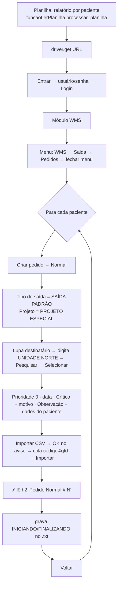
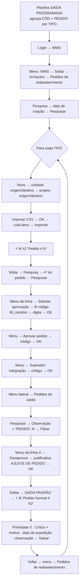
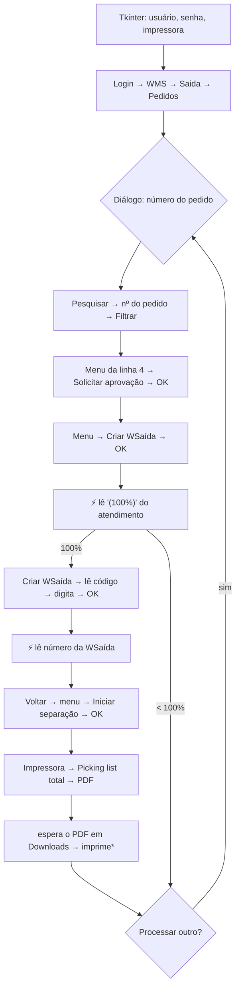

# Como funciona

Este documento explica o caminho que cada robô percorre no WMS e as decisões técnicas que permitiram rodar as automações de produção num sistema simulado, com o mínimo de mudanças no código.

## Esperas e robustez

Todas as ações dos robôs passam pelas funções de `funcaos.py`, que esperam o elemento ficar **clicável** (`element_to_be_clickable`) ou **presente** (`presence_of_element_located`). Se o elemento não aparece, a função tenta de novo com tempos maiores (5 s, depois 30 s) e, por último, recarrega a página e espera mais 40 s. Os pontos em que o robô lê a tela imediatamente, sem esperar, estão marcados com ⚡ nos fluxos abaixo.

## Fluxo de cada robô

### Robô que cria pedidos (`robo_cria_pedidos`)

### Robô de reabastecimento (`robo_reabastecimento`)

### Avançador de pedidos (`avancador_de_pedidos`)

\* Na demonstração a impressão é simulada (`IMPRIMIR_DE_VERDADE = False`).

## Como as planilhas viram dados no sistema

| Robô | Planilha | Colunas/linhas lidas | Vira |
|---|---|---|---|
| Cria pedidos | Relatório por paciente (sem cabeçalho; tudo na coluna C) | Linha com o identificador do paciente (no simulador: `Registro de paciente: 1234567_12345678`) + linha `Paciente:` (até a linha com `Agendado`) | Texto somado à **Observação** (`#mobs_ped`) e ao `.txt` de log |
| | | Blocos com `Estabelecimento` nas 2 linhas seguintes ao identificador | Ignorados |
| | | Após a linha com `Produto`: 1º valor não vazio da coluna D em diante = código; próximo número = quantidade | Linhas `código⭾qtd` no **#produtos** |
| | | Linha com `cancelado` | Encerra a leitura |
| Reabastecimento | Aba `SAÍDA PROGRAMADA` | `TIPO`, `CÓD`, `PEDIDO ` (com espaço), só `PEDIDO` ≠ vazio/0 | Um pedido de reabastecimento por TIPO; `CÓD⭾PEDIDO` na importação; o TIPO vai na observação do pedido de saída |
| Avançador | — | Número digitado no diálogo | Filtro `#filtro_nnumero_ped` |

## Como o simulador mantém os localizadores originais funcionando

1. **Contagem de `
` no `<body>`**: cada tela tem exatamente os mesmos `div` filhos do `body` que o original. Os diálogos ficam nas posições que os robôs esperam (ex.: `div[15]`, `div[16]`, `div[19]`, `div[24]`) com `
` invisíveis preenchendo as posições intermediárias.
2. **Tudo que o simulador adiciona dinamicamente ao `body`** (painel da demonstração, avisos, carregamento, faixa do rodapé) usa `<aside>`, `<section>` e `<footer>`, nunca `
`, para não mudar a contagem.
3. **Linhas auxiliares na tabela de pedidos**: as 3 primeiras linhas do `tbody` (resumo, "atualizando", "nenhum resultado") fazem o 1º pedido cair em `tr[4]`, como no original.
4. **Menus por status com posições fixas**: o menu de ações sempre tem 8 itens; o que muda é o texto (ex.: `li[6]` é "Solicitar aprovação" em digitação e "Iniciar separação" com WSaída criada).
5. **Mudança de status esconde a linha na hora do clique** e só redesenha depois do "processamento": o robô, que espera o elemento ficar clicável, nunca clica num menu desatualizado.
6. **Painel e avisos não bloqueiam cliques** (`pointer-events: none`), e a página tem folga no fim para qualquer elemento poder rolar até o topo: os robôs mais antigos usam clique nativo, que falha se algo estiver por cima.
